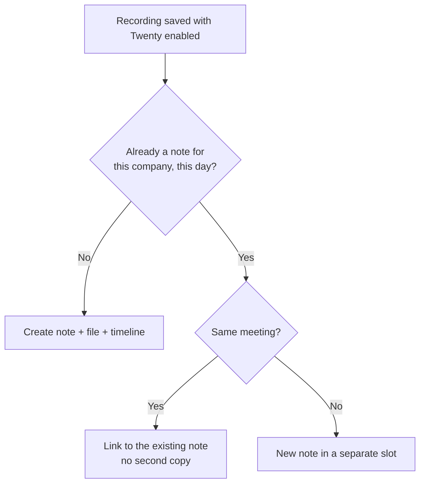

# CRM Sync (Twenty)

Client meetings are worth nothing to the rest of your company if they only live in Plan AI. This integration pushes each meeting into [Twenty](https://twenty.com), the open-source CRM, so whoever opens the client's record next sees what was said — without asking you.

Twenty is normally **self-hosted**, so unlike every other integration the API host is per workspace. You supply both the URL and the key.

## What lands in the CRM

One meeting produces three things on the company record:

| | What it is | Why separate |
| --- | --- | --- |
| **Note** | Date, attendees, summary, key points | Readable in five seconds from the timeline |
| **File** | The full transcript, `.md`, one line per speaker turn | The raw words, for when the summary isn't enough |
| **Timeline entry** | The note, stamped at the real meeting time | Puts the meeting in the right chronological place |

The split is deliberate. A wall of raw transcript pasted into a CRM timeline is unreadable, so the note stays a summary and the transcript rides along as an attachment you open only when you need it.

The timeline entry exists for a subtler reason: a note is dated when Plan AI **pushes** it, which can be hours after the call. Left alone, the CRM would tell the wrong story about when things happened. The timeline entry carries its own timestamp, so the meeting sits where it actually occurred.

::: info Calendar events
Twenty can also hold the meeting as a calendar event, and Plan AI does **not** create one. An event only shows its title when it belongs to a calendar channel, channels only exist for a connected Google or Microsoft account, and none can be created through the API — so an event we wrote would appear on the company as a row marked "Not shared", with the time but no title. A masked row is worse than no row.
:::

## Connecting your instance

1. In Twenty, go to **Settings → API & Webhooks** and create an API key.
2. In Plan AI, open **Settings → Integrations** and find the Twenty card.
3. Enter your instance URL (for example `https://crm.yourcompany.com`) and paste the key.

The URL must be `https`. Plan AI verifies the credentials by listing one company before saving, so a wrong key fails immediately instead of silently at the first meeting.

## Choosing the destination company

The company is chosen **per meeting**, on the save screen, right next to the "Send to Twenty" toggle — available in the desktop recorder, the mobile app and the web dashboard.

This is per meeting rather than per project on purpose: the same person attends calls with several different clients in a single day, so the destination belongs to the meeting, not to whatever project the recording happens to sit in.

If a project *is* linked to a company, that link pre-fills the picker so recurring client work is one less click. You can always override it.

::: warning No company, no note
If the toggle is on but no company is selected, nothing is pushed and the meeting is marked **Skipped** with the reason shown on the transcript. It is not a silent failure — check the integration badges on the meeting.
:::

## When two people record the same meeting

If you and a colleague both record the same client call, the client's CRM must not end up with two notes about one conversation.

Plan AI decides whether two recordings describe the same real-world meeting by comparing their capture windows — generous about overlap, because two people rarely hit record at the same second and someone always joins late, but strict about how far apart they started, so back-to-back calls with the same client don't collapse into one.

The second recording is linked to the note the first one produced, and it does **not** upload a second copy of the transcript or add a second timeline entry. Its transcript in Plan AI shows "a teammate already sent this meeting to Twenty".

If the two recordings really were different meetings with the same client on the same day, Plan AI creates a separate note rather than merging them.

## Sending a meeting by hand

Any meeting can be pushed manually from its transcript view, on both web and mobile — useful when a meeting was skipped because no company was picked, or when the push failed.

Only the first push creates the file and the timeline entry. A meeting that already has a note in the CRM won't get a second one.

## When something goes wrong

The note is created first and is the only step that can fail the push. If the transcript file or the timeline entry fails, the note is already in the CRM and correctly linked, the push still counts as a success, and the error is reported to your error tracker. Losing the note over a failed attachment would be a bad trade.

Every outcome — sent, skipped, failed — appears as a badge on the meeting, with the reason.
